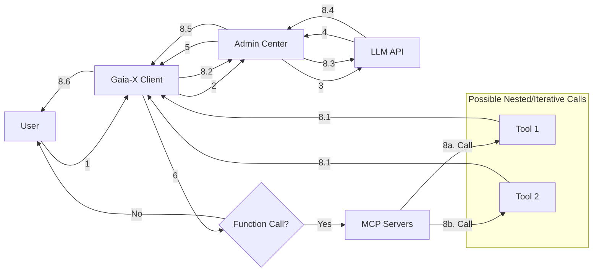
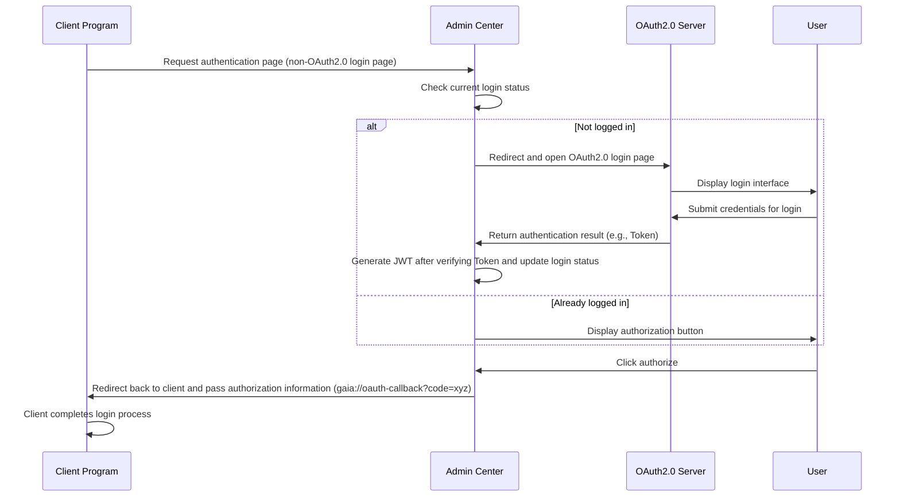

# Gaia-X Next-Generation Enterprise AI Application Platform Based on AI New Paradigm

## 🌟 Project Overview

**Gaia-X** is the first chatbot application platform designed for enterprise scenarios based on the new AI paradigm, addressing the core pain points of existing AI products with innovative technical architecture:

🚀 **Enterprise Management** | 🤖 **MCP Protocol Support** | 👥 **Multi-Agent Collaboration**  
💻 **Natural Language RPA** | ✅ **Human Confirmation Mechanism** | 🎨 **Intelligent Canvas Rendering**

[Try Now](#-quick-start) | [Admin Center](https://github.com/YFGaia/gaia-x) | [Documentation Center](https://gaia-x.gaiabot.ai)

## 🎯 Core Pain Point Solutions

| Pain Point Area                    | Gaia-X Innovative Solutions                                  |
| ---------------------------------- | ------------------------------------------------------------ |
| Lack of Enterprise Management      | Complete user/permission/billing system and LLM API hosting  |
| No MCP Protocol Support            | The first enterprise-grade MCP support                       |
| Risk of Sensitive Operations       | ReAct tool calls with human confirmation, dynamic rendering  |
| Difficulty in Natural Language RPA | Large model-driven RPA automation                            |
| Weak Multi-Agent Collaboration     | Intelligent Agent retrieval and multi-agent collaboration for complex tasks |

## 📦 Project Architecture
### 1.1 Overall Project Architecture

### 1.2 MCP Call Process

During the Agent call process, the management center is not responsible for calling MCP tools. Instead, after the client's node program receives the response results, it will uniformly determine if there are function calls. If so, it will call the corresponding MCP tools to execute. The execution chain is roughly as follows:

### 1.3 Client Authentication Logic at Startup

As this is an enterprise-level project, the client needs to complete login authentication before entering the Chatbot interface. Using OAuth2.0 as an example (other logic is similar), the authentication process is as follows:

**Process Explanation**:

1. Client requests authentication page from admin center;
2. Admin backend determines user login status;
3. If not logged in, redirects to OAuth2.0 login page;
4. User submits credentials on OAuth2.0 login page, returns authentication result after successful login;
5. After OAuth2.0 login, redirects to admin backend with authentication information, generates JWT and updates login status;
6. User clicks authorize button, admin backend redirects back to client, completing the login.

------

## 2. Core Features (Some still under development)

### 2.1 MCP (Model Context Protocol) Support

- [x] Support for integrating any community MCP Servers.
- [ ] Unified management of all MCP Servers through the enterprise management center.
- [x] All MCP Servers run in isolated sandbox environments on the client, ensuring operational security and data isolation.
- [ ] Independent MCP Server display page (similar to the official MCP Inspector effect)

### 2.2 Multi-Agent Intelligent Coordination

- [ ] Support for intelligent collaboration based on task orchestration or RAG, automatically completing complex tasks without manual selection of Agents or Workflows.
- [ ] Built-in key agents for computer operations, Python programming, web browsing, etc.

### 2.3 New Paradigm Infinite Canvas

- [ ] Each Agent process in Multi-Agent conversations is an independent canvas, automatically generating summaries as permanent memory.
- [x] Support for common Artifacts, including but not limited to:
  - SVG, HTML
  - Mermaid, Echarts, PlantUML
- [x] Support for MCP tools to dynamically render forms, allowing users to interactively modify and control submissions.
- [ ] Support for Python, TypeScript, HTML and other code execution

### 2.4 Intelligent Computer Operations

- [X] Integration with Claude Sonnet 3.5+, Zhipu CogAgent, ByteDance UI-TARS, OpenAI computer-use and other models.
- [X] Agents can autonomously execute any computer operation.

### 2.5 Text Selection Analysis

- [X] Support for automatically displaying Agent toolbar after text selection in any software interface, enabling instant functions such as translation and copywriting generation.

### 2.6 Enterprise Management Center

- [x] **Unified Authentication and User Management**: OAuth 2.0, LDAP, DingTalk, Feishu and other authentication methods.
- [x] **Unified Model and Tool Management**: Centralized configuration and authorization management in the backend.
- [ ] **Quota Management**: Fine-grained control of user quotas and API quotas.
- [ ] **Enterprise Internal Application Ecosystem**: MCP marketplace, Agent marketplace, application task marketplace (for specific complex tasks), etc.
- [ ] **Business Reports**: Comprehensive user, model, and Agent usage data analysis reports.

###  2.7 Third-party Agent Integration

- [x] Native support for integrating third-party Agent platforms such as Dify and Coze, with unified authorization management.

------

## 3. Technology Stack

### 3.1 Client

The client adopts a plugin-based design, and will later be architected with a micro-kernel plugin architecture similar to VS Code, enabling arbitrary extensions.

- **Framework**: Electron + React
- **LLM UI**: Ant Design X
- **Text Selection Monitoring Technology**: C++ (Windows), Objective-C (MacOS)

### 3.2 Admin Backend

The client only serves as an interactive UI and MCP management execution, without actual model calls. Model calls and tool calls are implemented by the backend. However, the backend is not responsible for the specific execution of MCP tools.

- **Large Model Interaction**: Eino Framework + Self-developed Multi-Agent
- **Admin UI**: Ant Design Pro (refactoring the frontend page code of GVA for technology stack uniformity)
- **API Service**: golang + Gin (based on the GVA framework)

### 3.3 MCP Server

- Runs in independent sandbox environment
- Supports implementation in both Python and TypeScript

------

## 4. Model Selection Reference

- **Computer Operation Models**: Claude Sonnet 3.5+, CogAgent, UI-TARS, OpenAI computer-use
- **ReAct Recommended Models**: Claude Sonnet 3.5+, GPT 4o (DeepSeek v3 model performs poorly, not recommended for critical tasks)

------

## 5. Acknowledgements

- The admin API is built based on [Gin-Vue-Admin](https://github.com/flipped-aurora/gin-vue-admin), reducing much of our basic management backend development work.

- [Eino](https://github.com/cloudwego/eino.git) by ByteDance is one of the few golang-based large model application development frameworks, solving basic model integration and Agent issues.

- We used [Ant Design Pro](https://github.com/ant-design/ant-design-pro) to refactor the frontend pages of [Gin-Vue-Admin](https://github.com/flipped-aurora/gin-vue-admin), unifying the UI frameworks for both the admin backend and client, reducing community development difficulty.

- We've made many secondary developments based on [Eino](https://github.com/cloudwego/eino.git), including integration of common model providers and Multi-Agent architecture. After secondary development, we published it as [Eino-X](https://github.com/YFGaia/eino-x).

- To solve the problem of running MCP Servers on ordinary user clients, we packaged an embedded binary MCP runtime environment (supporting MacOS and Windows) under the project [mcp-runtime](https://github.com/YFGaia/mcp-runtime).

------

## 6. License

This project is licensed under the [Apache 2.0 License](https://github.com/YFGaia/gaia-x/LICENSE). Feel free to customize or contribute!

------

## 7. Community Support

We welcome feedback and suggestions through Issues. We look forward to your participation in building the future enterprise AI application ecosystem together.

🎉 **Thank you for your attention and support to the project!**
