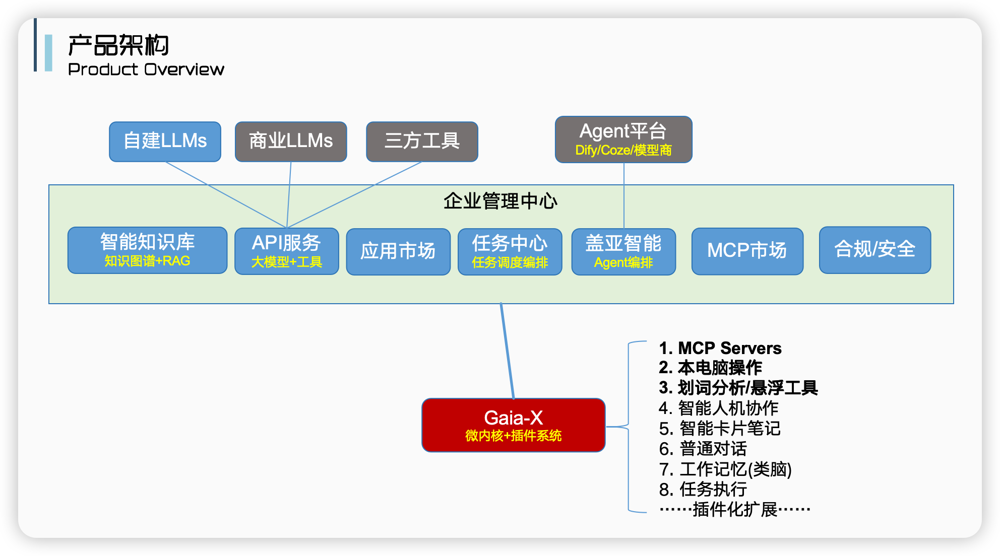
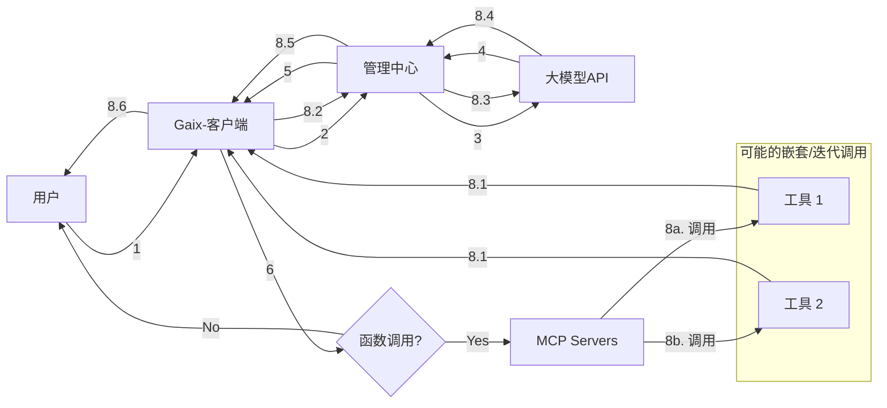
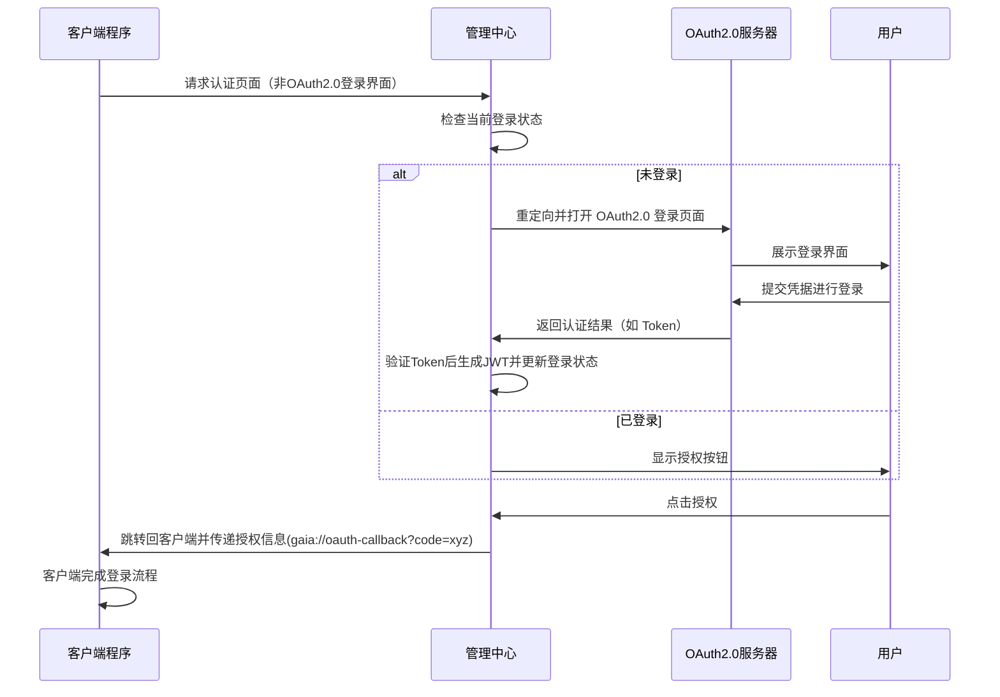

# Gaia-X 基于AI新范式的下一代企业级AI应用平台


## 🌟 项目概览

**Gaia-X** 是首个面向企业场景的、基于AI新范式开发的Chatbot应用平台，通过创新的技术架构解决现有AI产品的核心痛点：

🚀 **企业级管理**  | 🤖 **MCP协议支持**  | 👥 **Multi-Agent协作**  
💻 **自然语言RPA** | ✅ **人工确认机制** | 🎨 **智能画布渲染**

[立即体验](#-快速开始) | [管理中心](https://github.com/YFGaia/gaia-x) | [文档中心](https://gaia-x.gaiabot.ai)

## 🎯 核心痛点解决方案

| 痛点领域            | Gaia-X 创新方案                            |
| ------------------- | ------------------------------------------ |
| 企业级管理缺失      | 完整的用户/权限/计费体系/LLM API托管       |
| Agent平台不支持MCP  | 首个企业级MCP支持                          |
| 敏感操作风险        | ReAct工具调用人工确认，动态渲染            |
| 自然语言RPA实现困难 | 大模型驱动的RPA自动化操作                  |
| 多Agent协作薄弱     | 智能Agent检索与多Agent智能协作完成复杂任务 |

## 📦 项目架构
### 1.1 项目整体架构图



### 1.2 MCP调用

Agent调用过程中，在管理中心并不负责调用MCP工具，而是客户端的node程序收到响应的结果后，会统一判断是否存在函数调用，如果有，则调用对应的MCP工具执行。执行链大致主要如下：



### 1.3 客户端启动时的认证逻辑

由于本项目是一个企业级项目，客户端启动时需先进行登录认证后，才会进入到Chatbot界面。以OAuth2.0为例（其他逻辑相同），认证逻辑如下：



**流程说明**：

1. 客户端请求管理中心认证页面；
2. 管理后台判断用户登录状态；
3. 如未登录，则重定向到 OAuth2.0 登录页面；
4. 用户在 OAuth2.0 登录页面提交凭据，登录成功后返回认证结果；
5. OAuth2.0登录后携带认证信息跳转管理后台，生成JWT并更新登录状态；
6. 用户点击授权按钮，管理后台跳转回客户端，完成登录。

------

## 2. 核心功能(部分还处于开发中)

### 2.1 支持 MCP（Model Context Protocol）

- [x] 支持社区任意 MCP Servers 的接入。
- [ ] 企业管理中心可统一管理所有 MCP Servers。
- [x] 所有 MCP Servers 在客户端独立的沙盒环境中运行，确保运行安全和数据隔离。
- [ ] 独立MCP Server展示页面（类似MCP 官方Inspector 效果）

### 2.2 Multi-Agent 智能协调

- [ ] 支持基于任务编排或 RAG 的智能协作，自动完成复杂任务，无需人工选择 Agent 或 Workflow。
- [ ] 内置电脑操作、Python编程、网页浏览等关键智能体。

### 2.3 新范式无限 Canvas

- [ ] Multi-Agent 对话中每个 Agent 流程均为独立的画板，并自动生成概要作为永久记忆。
- [x] 常见 Artifacts 支持，包括但不限于：
  - SVG、HTML
  - Mermaid、Echarts、PlantUML
- [x] 支持 MCP 工具动态渲染表单，用户可交互修改并控制提交。
- [ ] 支持Python、TypeScript、HTML等代码执行

### 2.4 智能电脑操作

- [X] 集成 Claude Sonnet 3.5+、智普 CogAgent、字节 UI-TARS、OpenAI computer-use 等模型。
- [X] Agent 可自主执行任意电脑操作。

### 2.5 划词分析功能

- [X] 支持任意软件界面划词后自动弹出 Agent 工具条，实现如翻译、文案生成等即时功能。

### 2.6 企业级管理中心

- [x] **统一认证与用户管理**：OAuth 2.0、LDAP、钉钉、飞书等认证方式。
- [x] **统一模型和工具管理**：后台集中配置和授权管理。
- [ ] **额度管理**：用户额度与 API 额度精细化控制。
- [ ] **企业内部应用生态**：MCP市场、Agent市场、应用任务市场（特定复杂任务）等
- [ ] **业务报表**：全面的用户、模型和 Agent 使用数据分析报表。

###  2.7 第三方 Agent 接入

- [x] 原生支持接入 Dify、Coze 等第三方 Agent 平台，并实现统一授权管理。

------

## 3. 技术栈

### 3.1 客户端

客户端采用插件化设计，后来将架构为类似VS Code这样的微内核插件化架构，实现任意扩展。

- **框架**：Electron + React
- **交互 UI**：Ant Design X
- **划词监听技术**：C++（Windows）、Objective-C（MacOS）

### 3.2 管理后台

客户端仅作为交互 UI 与 MCP 管理执行，不包含实际模型调用，模型调用和工具调用均由后台实现。但后台不负责MCP工具具体执行。

- **大模型交互**：Eino 框架 + 自研 Multi-Agent
- **管理后台UI**：Ant Design Pro（重构GVA的前端页面部分代码使技术栈统一）
- **API服务**：golang + Gin（基于 GVA 框架）

### 3.3 MCP Server

- 独立沙盒环境运行
- 支持 Python 和 TypeScript 两种语言实现

------

## 4. 模型选择参考

- **电脑操作模型**：Claude Sonnet 3.5+、CogAgent、UI-TARS、OpenAI computer-use
- **ReAct 推荐模型**：Claude Sonnet 3.5+、GPT 4o（DeepSeek v3 模型表现较差，不推荐用于关键任务）

------

## 5. 相关命令

### 客户端开发相关命令

```bash
# 安装依赖
pnpm install

# 启动开发环境
pnpm dev

# 构建客户端应用
pnpm build

# 构建并打包客户端
pnpm build:win     # Windows版本
pnpm build:mac     # macOS版本

# 清理构建文件
pnpm clean
```

### MCP服务相关命令

```bash
# 初始化MCP运行环境
pnpm run mcp:init

# 安装MCP工具
pnpm run mcp:install <工具名称>

# 启动MCP服务器
pnpm run mcp:start

# 列出已安装的MCP工具
pnpm run mcp:list
```

### 管理中心相关命令

```bash
# 启动管理中心API服务
cd apps/admin/server
go run main.go

# 启动管理中心前端
cd apps/admin/web
pnpm install
pnpm dev
```

### 常见问题排查命令

```bash
# 检查Python环境
pnpm run check:python

# 检查Node.js环境
pnpm run check:node

# 测试MCP工具连接
pnpm run test:mcp

# 查看日志
pnpm run logs
```

## 6. 相关项目鸣谢

- 基于[Gin-Vue-Admin](https://github.com/flipped-aurora/gin-vue-admin) 构建了后台API，让我们减少很多基础管理的后台开发工作。

- 字节开源的[Eino](https://github.com/cloudwego/eino.git)是少有的基于golang 的大模型应用开发框架，解决大模型基础模型集成、Agent等。

- 我们使用[Ant Design Pro](https://github.com/ant-design/ant-design-pro)重构了[Gin-Vue-Admin](https://github.com/flipped-aurora/gin-vue-admin) 管理后台的前端页面，使得后台管理和客户端都的UI框架实现统一，减少社区开发难度。

- 在[Eino](https://github.com/cloudwego/eino.git)的基础上，我们做了很多二开，包括常见模型供应商的接入、Multi-Agent架构等，二开后我们发布在[Eino-X](https://github.com/YFGaia/eino-x) 。

- 为了解决普通用户客户端运行MCP Servers的问题，我们打包了支持嵌入式二进制MCP运行环境（支持MacOS和Windows），放下项目[mcp-runtime](https://github.com/YFGaia/mcp-runtime) 下。

------

## 7. 开源协议

本项目使用 [Apache 2.0 协议](https://github.com/YFGaia/gaia-x/LICENSE)。欢迎自行二开定制或参与贡献！

------

## 8. 社区支持

欢迎通过 Issue 提交反馈和建议，我们期待你的加入，一起构建未来的企业级 AI 应用生态。

🎉 **感谢你对项目的关注与支持！** 